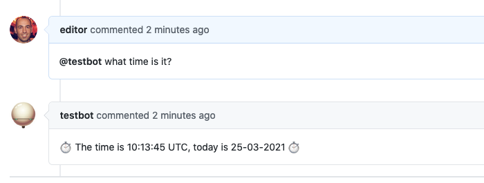

Creating a custom responder
===========================

Buffy will load and make available any responder that is located in the `app/responders` directory. The simplest way to organize your responders is to add them in a subfolder inside the `responders` dir, defining a module for the custom responders.

During this guide as an example, we'll create a simple responder to get the time.

## Responder structure
A responder is a ruby class containing five elements:
* **keyname**: the handle for the responder in the configuration file
* **define_listening** method: a place to declare what events the responder is listening to
* **process_message** method: the code to perform whatever the responder does
* **description** method: to add a short description of the responder for documenting purposes
* **example_invocation** method: to show users how to invoke the responder

### The Responder Ruby class
A responder object is a class inheriting from the Responder class, so you should require the Responder class located in `/lib` and create a child class.


When initialized, a responder will have accessor methods for the name of the bot (`bot_name`) and for the parameters of the responder coming from the config file (`params`).


```text
For our example we add a clock_responder.rb file to the new app/responders/myorganization dir.
It declares the responder class in the myorganization module.
```

```ruby
require_relative '../../lib/responder'

module Myorganization
  class ClockResponder < Responder
  end
end
```


### Keyname

Using `keyname` you can define the handle for the responder to be used in the configuration file. Using a symbol is ok.

For our example we'll just use _clock_:

```ruby
require_relative '../../lib/responder'

module Myorganization
  class ClockResponder < Responder
    keyname :clock
  end
end
```
Now we can use the responder adding it to the [config.yml](./configuration) file:
```yaml
...
  responders:
    clock:
...
```

### Define listening

The `define_listening` method is the place to specify what the responder is listening to.
You can set values for two instance variables here:
* **@event_action**: the action that triggered the event the responder will listen to
* **@event_regex**: (optional) a regular expression the text body of the event (a comment or the body of an issue) should match for the responder to respond

When an event is sent from the reviews repository to Buffy, only responders that match action and regex (if present) will be run.

#### Event action
* If you are listening to creation of issues, _@event_action_ should be `"issues.opened"`.
* If you are listening to new comments, _@event_action_ should be `"issue_comment.created""`.

#### Event regex
The _@event_regex_ variable is where the syntax of every specific command is declared. If it is `nil` the responder will respond to every event that matches _@event_action_.

Inside this method you have available the name of the bot in the `@botname` instace variable and all the parameters for this responder from the config file in the `@params` instance variable.

For our example, we will be listening to comments and we want the command to be "what time is it?":
```ruby
require_relative '../../lib/responder'

module Myorganization
  class ClockResponder < Responder
    keyname :clock

    def define_listening
      @event_action = "issue_comment.created"
      @event_regex = /\A@#{bot_name} what time is it\?\s*\z/i
    end
  end
end
```

#### Mandatory parameters
You can also declare inside this method which parameters are required in the configuration using `required_params`. This will create a reader method for every required parameter.

For example, we could make the command for invoking our responder mandatory and declared in the config.yml file instead that in our regex, that way the command for our responder can be changed and be easily configured:
```ruby
require_relative '../../lib/responder'

module Myorganization
  class ClockResponder < Responder
    keyname :clock

    def define_listening
      required_params :command

      @event_action = "issue_comment.created"
      @event_regex = /\A@#{bot_name} #{command}\s*\z/i
    end
  end
end
```
now the command must be added to the config file or the responder will error and not run:
```yaml
...
  responders:
    clock:
      command: tell me the time
...
````

But we don't want to be too strict so, we'll allow the command to be changed but by default we'll have one. For that we'll use an auxiliary instance method:

```ruby
require_relative '../../lib/responder'

module Myorganization
  class ClockResponder < Responder
    keyname :clock

    def define_listening
      @event_action = "issue_comment.created"
      @event_regex = /\A@#{bot_name} #{clock_command}\s*\z/i
    end

    def clock_command
      params[:command] || "what time is it\\?"
    end
  end
end
```


### Process message
The `process_message` method will be called if an event reaches Buffy and it matches the action and the regex in the _define_listening_ method.
It accepts a single argument: the message that triggered the call.

This method is the place of all the custom Ruby code needed to perform whatever is the responder does.
To interact back with the reviews repository there are several methods available:
* **respond(message)**: will post a comment with the specified _message_ string
* **respond_external_template(template_name, locals)**: will post a comment using [a template](./using_templates) and passing it the _locals_ variables
* **update_body(mark, end_mark, text)**: will update the body of the issue between marks with the passed _text_
* **add_assignee(user)**: will add the passed _user_ to the issue's assignees
* **remove_assignee(user)**: will remove the passed _user_ from the issue's assignees
* **replace_assignee(old_user, new_user)**: will replace the passed _old_user_ with _new_user_ in the issue's assignees
* **process_labeling**: will add/remove labels as specified in the responder [config params](./labeling)

If you need to access any matched data from the [_@event_regex_](#event-regex) you have them available via the `match_data` array.

For our example we'll just reply a comment with the time:
```ruby
require_relative '../../lib/responder'

module Myorganization
  class ClockResponder < Responder
    ...

    def process_message(message)
      respond(Time.now.strftime("⏱ The time is %H:%M:%S %Z, today is %d-%m-%Y ⏱"))
    end

  end
end
```

### Description

Use the `description` method to add a short description of what the responder does.

Our example responder replies with the current time:
```ruby
require_relative '../../lib/responder'

module Myorganization
  class ClockResponder < Responder
    ...

    def description
      "Get the current time"
    end
  end
end
```

### Example invocation
To help users understand how to use the responder, use the `example_invocation` to add an example of how the responder is triggered.

In our example responder we'll use the command declared via config or the default one:

```ruby
require_relative '../../lib/responder'

module Myorganization
  class ClockResponder < Responder
    ...

    def example_invocation
      "@#{bot_name} #{params[:command] || 'what time is it?'}"
    end
  end
end
```

## Sample custom responder

The final version of our clock responder (in `app/responders/myorganization/clock_responder.rb`):
```ruby
require_relative '../../lib/responder'

module Myorganization
  class ClockResponder < Responder
    keyname :clock

    def define_listening
      @event_action = "issue_comment.created"
      @event_regex = /\A@#{bot_name} #{clock_command}\s*\z/i
    end

    def process_message(message)
      respond(Time.now.strftime("⏱ The time is %H:%M:%S %Z, today is %d-%m-%Y ⏱"))
    end

    def clock_command
      params[:command] || "what time is it\\?"
    end

    def description
      "Get the current time"
    end

    def example_invocation
      "@#{bot_name} #{params[:command] || 'what time is it?'}"
    end
  end
end
```

Adding its key to the configuration file in the responder settings:
```yaml
buffy:
  responders:
    clock:
...
```

The responder should be available and ready to use:



## Tests

Don't forget to add tests for any new Responder you create. Buffy uses the [RSpec](https://rspec.info/) test framework.


For our sample responder, we would create
 _spec/responders/myorganization/clock_responder_spec.rb_
```ruby
require_relative "../../spec_helper.rb"

describe Myorganization::ClockResponder do

  subject do
    described_class
  end

  describe "listening" do
    before { @responder = subject.new({env: {bot_github_user: "testbot"}}, {}) }

    it "should listen to new comments" do
      expect(@responder.event_action).to eq("issue_comment.created")
    end

    it "should define regex" do
      expect(@responder.event_regex).to match("@testbot what time is it?")
      expect(@responder.event_regex).to_not match("@testbot whatever")
    end

    it "should allow invocation with custom command" do
      custom_responder = subject.new({env: {bot_github_user: "testbot"}},
                                     {command: "tell me the time"})
      expect(custom_responder.event_regex).to match("@testbot tell me the time")
      expect(custom_responder.event_regex).to_not match("@botsci what time is it?")
    end
  end

  describe "#process_message" do
    before do
      @responder = subject.new({env: {bot_github_user: "botsci"}}, {})
      disable_github_calls_for(@responder)
    end

    it "should respond to github" do
      timenow = Time.now
      expected_response = timenow.strftime("⏱ The time is %H:%M:%S %Z, today is %d-%m-%Y ⏱")
      expect(Time).to receive(:now).and_respond(timenow)
      expect(@responder).to receive(:respond).with(expected_response)
      @responder.process_message("@testbot what time is it?")
    end
  end
end

```

You can find more examples of responder specs in the `/spec/responders` directory.
