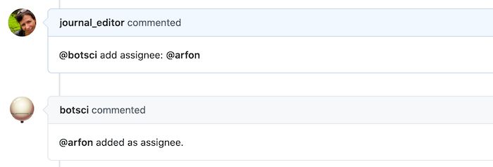

Add/Remove assignee
===================

This responder adds and removes users to the assignees list of the issue.

## Listens to

```
@botname add assignee: @username
```
```
@botname remove assignee: @username
```
## Requirements

Only users that are collaborators in the target issue can be added as assignees. Otherwise the responder will reply with a _not enough permissions_ message.

## Settings key

`add_remove_assignee`

## Examples

**Simplest use case:**
```yaml
...
  responders:
    add_remove_assignee:
...
```

**Hidden from command list and restricted to editors:**
```yaml
...
  responders:
    add_remove_assignee:
      only: editors
      hidden: true
...
```

## In action


