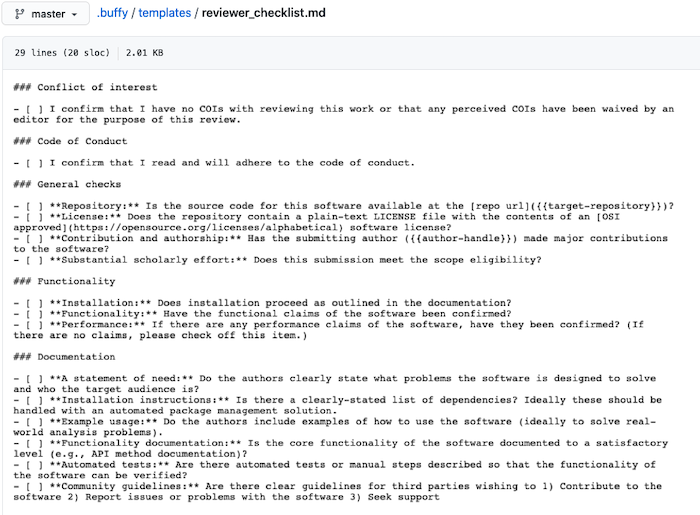
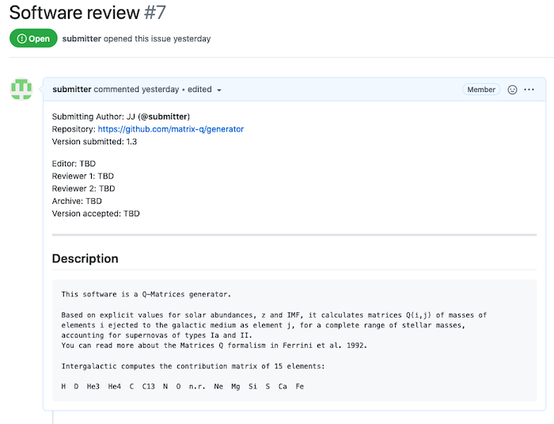
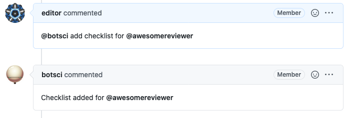
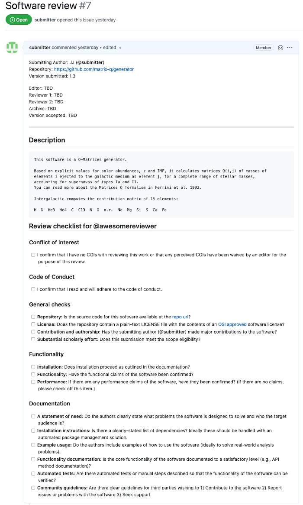

Add/Remove checklist
====================

This responder adds and removes checklists for reviewers at the end of the body of the issue.

## Listens to

```
@botname add checklist for @username
```
```
@botname remove checklist for @username
```
## Requirements

The checklist is read from a template file that should be available in the repository.

## Settings key

`add_remove_checklist`

## Params
```eval_rst
:template_file: *Required*. The name of the template file to append to the body.
:data_from_issue: *<Array>* An optional list of values that will be extracted from the issue's body and used to fill the template.
```

## Examples

**Simplest use case:**
```yaml
...
  responders:
    add_remove_checklist:
      template_file: reviewer_checklist.md
...
```

**Using info from the body to fill in the template. Action restricted to editors:**
```yaml
...
  responders:
    add_remove_checklist:
      only: editors
      template_file: reviewer_checklist.md
      data_from_issue:
        - target-repository
        - author-handle
...
```

## In action

* **`The template:`**



* **`Initial state:`**



* **`Invocation:`**



* **`Final state:`**


