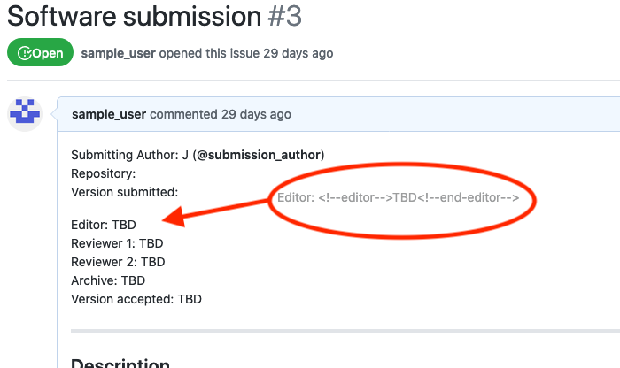
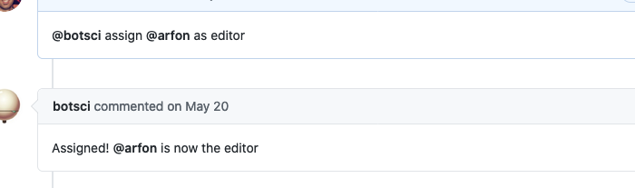
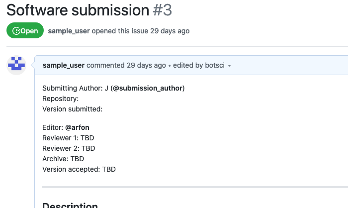

Assign editor
=============

Use this responder to update the value of the editor in the body of the issue.
Allows [labeling](../labeling).

## Listens to

```
@botname assign @username as editor
```

## Requirements

The body of the issue should have the editor placeholder marked with HTML comments.

```html
<!--editor-->  <!--end-editor-->
```

## Settings key

`assign_editor`

## Params
```eval_rst
:add_as_assignee: *<Boolean>* If true, the editor user will be added as assignee to the issue. Default value is **true**.

:add_as_collaborator: *<Boolean>* If true, the editor user will be added as collaborator to the repo. Default value is **false**.

:external_call: *Optional* Configuration for a external service call. All available subparams are described in the `external_service docs`_.

.. _`external_service docs`: ./external_service.html#params
```

## Examples

**Simplest use case:**
```yaml
...
  responders:
    assign_editor:
...
```

**Restricted to editors:**
```yaml
...
  teams:
    editors: 1111111
...
  responders:
    assign_editor:
      only: editors
...
```

**Restrict access to editors and add user as assignee and collaborator:**
```yaml
...
  responders:
    assign_editor:
      only: editors
      add_as_collaborator: true
...
```

## In action

* **`Initial state:`**



* **`Invocation:`**



* **`Final state:`**


