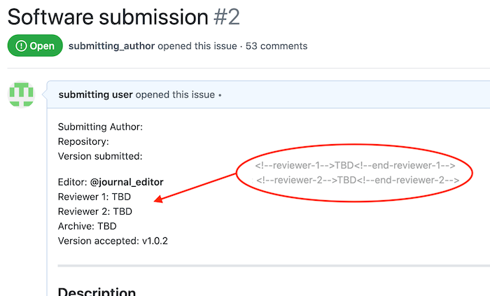
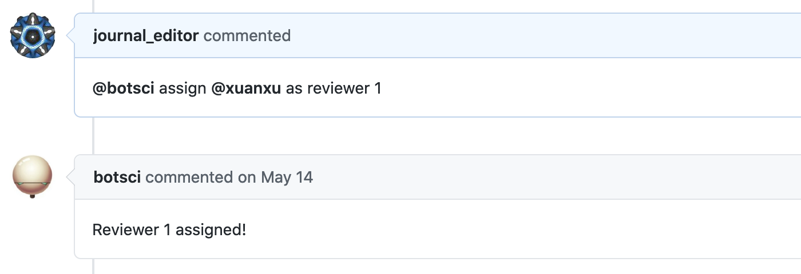
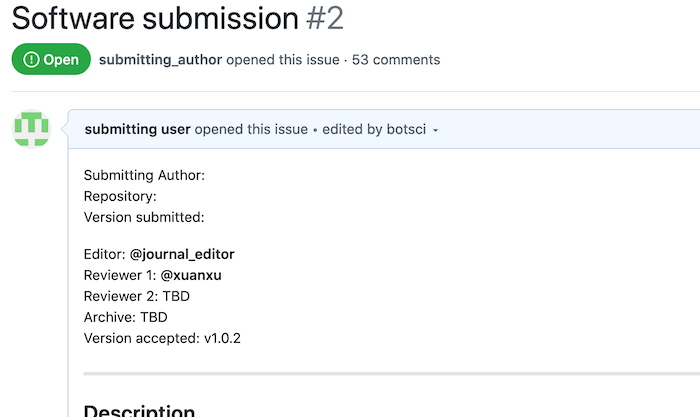

Assign reviewer N
=================

Use this responder to update the value of a numbered reviewer in the body of the issue.

## Listens to

```
@botname assign @username as reviewer N
```
where N is a number.


## Requirements

The body of the issue should have placeholders marked with HTML comments for all the accepted reviewers.

```html
Reviewer 1: <!--reviewer-1--> Pending <!--end-reviewer-1-->
Reviewer 2: <!--reviewer-2--> Pending <!--end-reviewer-2-->
Reviewer 3: <!--reviewer-3--> Pending <!--end-reviewer-3-->
...
```

## Settings key

`assign_reviewer_n`

## Params
```eval_rst
:add_as_assignee: *<Boolean>* If true, the new reviewer will be added as assignee to the issue. Default value is **true**.

:add_as_collaborator: *<Boolean>* If true, the new reviewer will be added as collaborator to the repo. Default value is **true**.
```

## Examples

**Simplest use case:**
```yaml
...
  responders:
    assign_reviewer_n:
...
```
By default reviewer will be added as assignee to the issue and collaborator of the repo.

**Action restricted to editors:**
```yaml
...
  teams:
    editors: 1111111
...
  responders:
    assign_reviewer_n:
      only: editors
...
```

**Restrict access to editors, adding the reviewer as collaborator but not adding the reviewer as assignee:**
```yaml
...
  responders:
    assign_reviewer_n:
      only: editors
      add_as_collaborator: false
...
```

## In action

* **`Initial state:`**



* **`Invocation:`**



* **`Final state:`**



