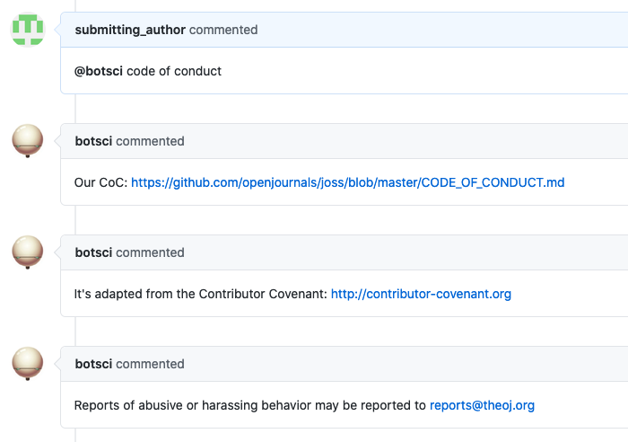
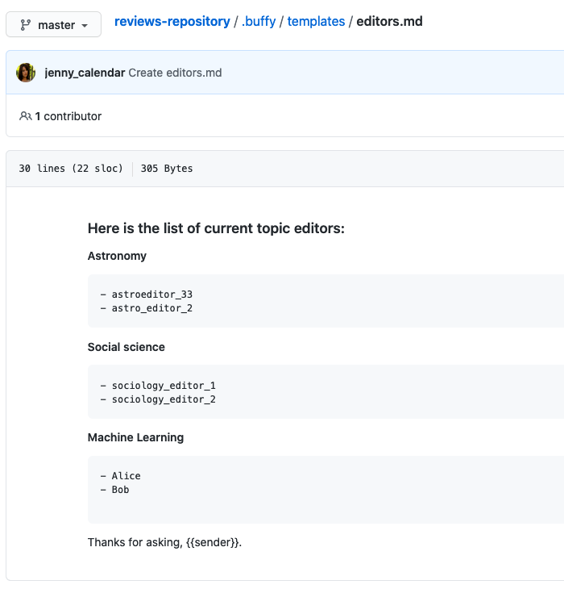
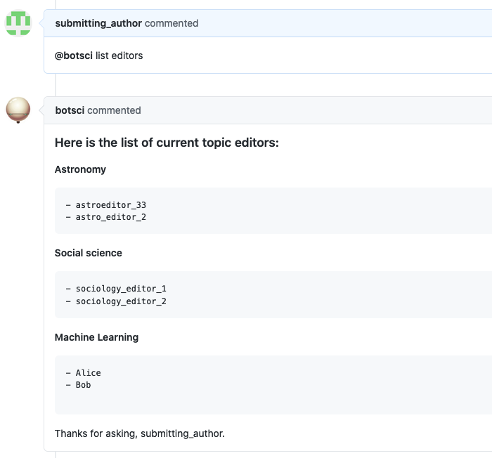

Basic command
=============

This responder defines a custom command and replies with text messages, optionally [using a template](../using_templates).
Allows [labeling](../labeling).

## Listens to

```
@botname <command>
```

For example, if you configure the command to be _list editors_, it would respond to:
```
@botname list editors
```

## Settings key

`basic_command`

## Params
```eval_rst
:command: The command this responder will listen to.
:description:  *Optional* String to show when the help command is invoked.
:example_invocation:  *Optional* String to show as an example of the command being used when the help command is invoked.
:message: *Optional* A text message to use as reply.
:messages: *Optional <Array>* A list of text messages to respond with.
:template_file: *Optional* A template file to use to build the response message.
:data_from_issue: *<Array>* An optional list of values that will be extracted from the issue's body and used to fill the template.
:external_call: *Optional* Configuration for a external service call. All available subparams are described in the `external_service docs`_.

.. _`external_service docs`: ./external_service.html#params
```

## Examples

**Simplest use case:**

Reply with a preconfigured text

```yaml
...
  responders:
    basic_command:
      command: issue complaint
      message: "Please send an email to reports@open.journal"

...
```

**Multiple instances of the responder, multiple replies, using a template to respond:**
```yaml
...
  responders:
    basic_command:
      - code_of_conduct:
          command: code of conduct
          description: Show our community Code of Conduct and Guidelines
          messages:
            - "Our CoC: https://github.com/openjournals/joss/blob/master/CODE_OF_CONDUCT.md"
            - "It's adapted from the Contributor Covenant: http://contributor-covenant.org"
            - "Reports of abusive or harassing behavior may be reported to reports@theoj.org"
      - editor_list:
          command: list editors
          description: List all current topic editors
          template_file: editors.md
...
```

## In action

* **`Multiple responses:`**



* **`Replying with a template - The template file:`**



* **`Replying with a template - In use:`**


