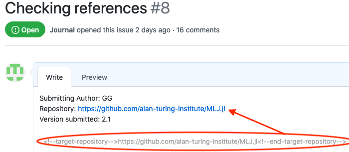
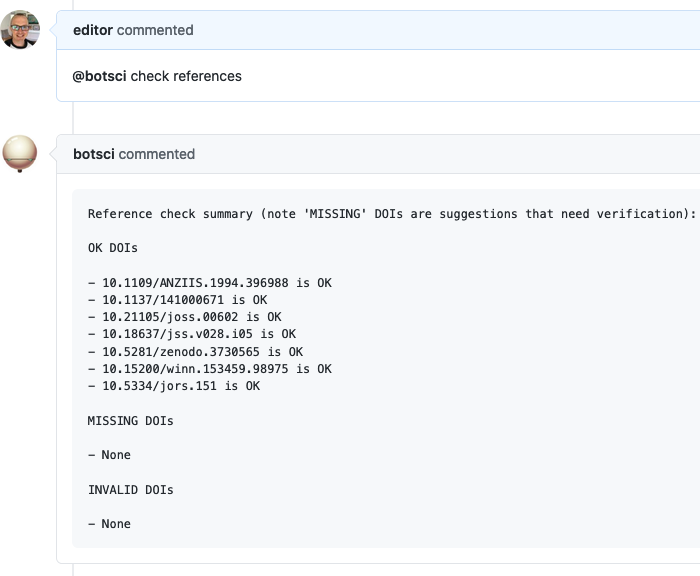
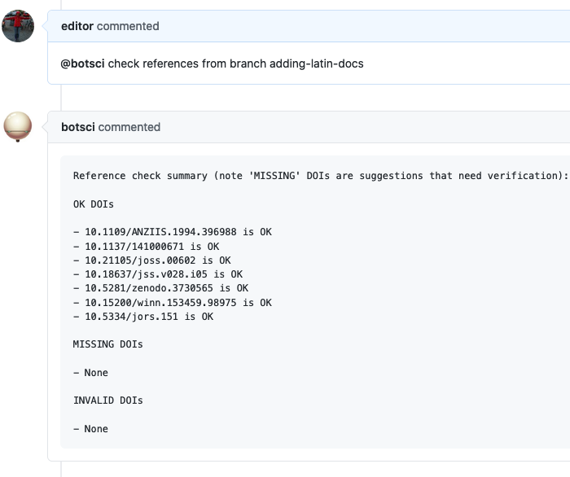

Check references
================

This responder checks (asynchronously) the validity of the DOIs from a list of BibTeX entries (a paper's references file).

## Listens to

```
@botname check references
```

A non-default branch can be specified to look for the paper's files in it:
```
@botname check references from branch <custom-branch-name>
```

## Requirements

The target repository should include a paper.md or paper.tex file and its corresponding references file (paper.bib or paper.yml) with the BIbTeX entries.

The body of the issue should have the url of the repository with the paper's files marked with HTML comments.

```html
<!--target-repository--> URL HERE <!--end-target-repository-->
```

## Settings key

`check_references`

## Params
```eval_rst
:url_field: The optional name of the field marked with HTML comments where the URL of the repository with the paper is located. By default if this setting is not present, the value will be **target-repository**. Meaning Buffy will look for a string in the body of the issue between **<!--target-repository-->** and **<!--end-target-repository-->** HTML comments.
:branch_field: The optional name of the field marked with HTML comments where the name of the branch is located. Defaults to **branch** (so Buffy will look for **<!--branch-->** and **<!--end-branch-->** in the body of the issue). If the setting is not present or the branch field is not found in the body of the issue, the default branch of the git repo will be used.

```

## Examples

**Simplest case:**
```yaml
...
  check_references:
...
```
Buffy will clone the git repository specified between `<!--target-repository-->` and `<!--end-target-repository-->` marks and check the DOIs for all entries in the paper.bib file.


**Example customizing fields:**
```yaml
...
  check_references:
      url_field: software-location
      branch_field: branch-to-review
...
```
Buffy will clone the git repository specified between `<!--software-location-->` and `<!--end-software-location-->` marks, then checkout into the branch specified between `<!--branch-to-review-->` and `<!--end-branch-to-review-->` and then check the DOIs for all entries in the paper.bib file.


## In action

* **`Issue body with the repository's URL:`**




* **`In use:`**




* **`With non-default branch:`**



