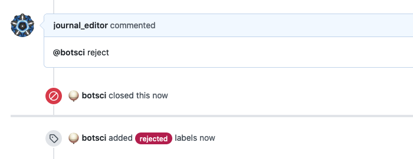

Close issue command
===================

This responder replies to a specific command closing the issue and possibly adding some labels.

## Listens to

```
@botname <command>
```

For example, if you configure the command to be _reject_, it would respond to:
```
@botname reject
```

## Settings key

`close_issue_command`

## Params

```eval_rst
:command: The command this responder will listen to.
:labels:  *Optional <Array>* A list of text labels to add to the issue.
```

## Examples

**Simplest use case:**

Just close the issue.

```yaml
...
  responders:
    close_issue_command:
      command: reject
...
```

**Close issue, add labels, restrict access to editors:**
```yaml
...
  responders:
    close_issue_command:
      only: editors
      command: reject
      labels:
        - rejected
...
```

## In action


