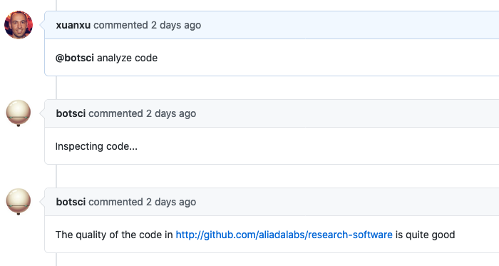
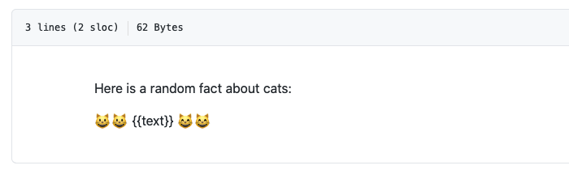
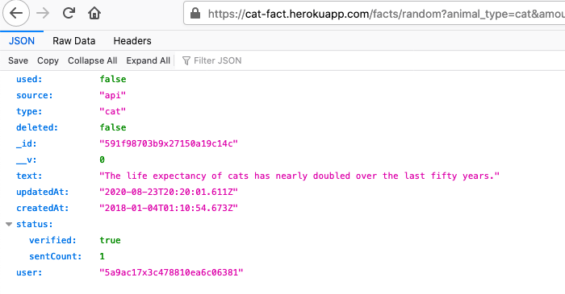
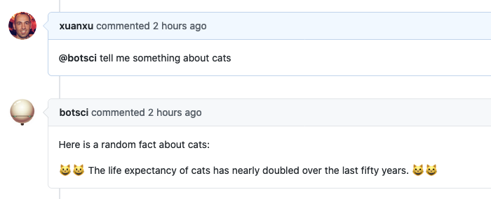

External service
================

This responder creates a background job to asynchronously call an external service's API. If the call is successful the response is posted as a comment in the issue (optionally using a template).

## Listens to

```
@botname <command>
```

For example, if you configure the command to be _analyze code_, it would respond to:
```
@botname analyze code
```

## Requirements

Some parameters are required for the responder to work: the `name` of the service, the `command` to invoke it, and the `url` of the call. All can be set using the settings YAML file.

### If using a template

If you want to use a template to respond, Buffy will look for the file declared in the `template_file` param in the target repo, in the location specified with the `template_path` setting (by default `.buffy/templates`). In short: the *template_file* should be located in the *template_path*.

The response from the external service should be in JSON format. It will be parsed and the resulting hash values will be passed to the template, where they can be used with the syntax:
```
{{variable_name}}
```

## Settings key

`external_service`

## Params

_General_

```eval_rst
:name: *Required*. The name for this service.
:command: *Required*. The command this responder will listen to.
:description: The description of the service. It will show in the help command if the responder is not hidden.
:message: An optional message to reply when the command is received, before the external service is called.

```

_Configuring the request_

```eval_rst
:url: *Required*. The url to call.
:method: The HTTP method to use. Valid values: [get, post]. Default is **post**.
:headers: *<Array>* An optional list of *key: value* pairs to be passed as headers in the external service request.
:query_params: *<Array>* An optional list of params to add to the query of the external call. Common place to add API_KEYS or other authentication info.
:data_from_issue: *<Array>* An optional list of values that will be extracted from the issue's info or issue's body and sent as query params to the service call. Available info includes: *issue_id*, *issue_author*, *repo*, *sender*, *bot_name*, and any variable included in the body of the issue. Also if the command matches any data it will be available as *match_data_1*, *match_data_2*, etc.
:mapping: *<Array>* An optional mapping of variable names in the query of the external service call.

```

_Configuring the response_

```eval_rst
:template_file: The optional template file to use to build the response message if the response from the external service is successful.
:success_msg: Optional message to respond with if the service call is successful.
:error_msg: Optional message to respond with if the service call fails with a 400/500 response.
:silent: *<Boolean>* Optional parameter, if **true** the responder won't reply after the external service is called (*template_file*, *success_msg* and *error_msg* will overwrite this if present). Default is **false**.
:add_labels: *<Array>* Optional parameter. Labels to add to the issue if the external service call is successful.
:remove_labels: *<Array>* Optional parameter. Labels to remove from the issue if the external service call is successful.
:close: *<Boolean>* Optional parameter, if **true** the responder will close the issue if the external service call is successful. Default is **false**.


```

## Examples

**A simple case using a template:**
```yaml
...
  external_service:
      name: cat_facts
      command: tell me something about cats
      description: Random facts about cats
      url: "https://cat-fact.herokuapp.com/facts/random"
      method: get
      query_params:
          animal_type: cat
          amount: 1
      template_file: cats.md
...
```
The request will be https://cat-fact.herokuapp.com/facts/random?animal_type=cat&amount=1 and the response will be passed to the _cats.md_ template.


**A complete example:**
```yaml
...
  external_service:
      - code_quality:
          only: editors
          command: analyze code
          description: Reports on the quality of the code
          message: Inspecting code...
          url: https://dummy-external-service.herokuapp.com/code-analysis
          method: post
          query_params:
            secret: A1234567890Z
          data_from_issue:
            - target-repo
          mapping:
            id: issue_id
...
```
Once the responder is invoked it will reply with _"Inspecting code..."_ as a comment in the issue.
Later, a POST request will be sent to https://dummy-external-service.herokuapp.com/code-analysis with a JSON body:
```
{
 "secret": "A1234567890Z", # declared in the query_params setting
 "target-repo":"...",      # the value is extracted from the body of the issue
 "id":"...",               # the value corresponds to issue_id, it has been mapped to id
 "repo":"...",             # the origin repo where the invocation happend
 "sender":"...",           # the user invoking the command
 "bot_name":"...",         # the bot user name that will be responding
}
```
And the response will posted as a comment in the original issue.

## In action

* **`In use:`**



### With a template as response

* **`The template file:`**



* **`The JSON response:`**



* **`In use:`**



