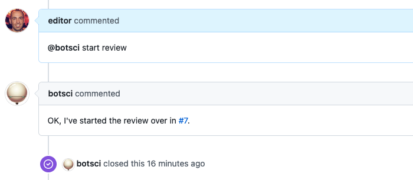

External start review
=====================

This responder checks for the presence of editor and reviewers in an issue and then delegates the creation of a new review isuue to an external API call.

## Listens to

```
@botname start review
```

## Requirements

The parameters required for the responder to work are the ones configuring the external API call, nested under the `external_call` parameter.


## Settings key

`external_start_review`

## Params

```eval_rst
:external_call: *Required*. Nested under this parameter is the configuration for the external call that will start the review. All available subparams are described in the `external_service docs`_.

:review_title_regex: *Optional*. By default the responder will check that this command has not been triggered from a review issue by checking the title. If it starts with `[REVIEW]:` the command will be rejected. This parameter allows to specify a different string/regex to identify a review issue matching the title.

.. _`external_service docs`: ./external_service.html#params

```


## Examples

**Restricted to editors, respond with a template and close the issue:**
```yaml
...
  external_start_review:
      only: editors
      external_call:
        url: "https://test.joss.theoj.org/papers/api_start_review"
        query_params:
          secret: <%= ENV['TEST_SECRET'] %>
        mapping:
          id: issue_id
          editor: editor_login
          reviewers: reviewers_logins
        silent: true
        template_file: "review_started.md"
        close: true
...
```

The responder will call https://test.joss.theoj.org/papers/api_start_review and the response will be passed to the _review_started.md_ template.

## In action



