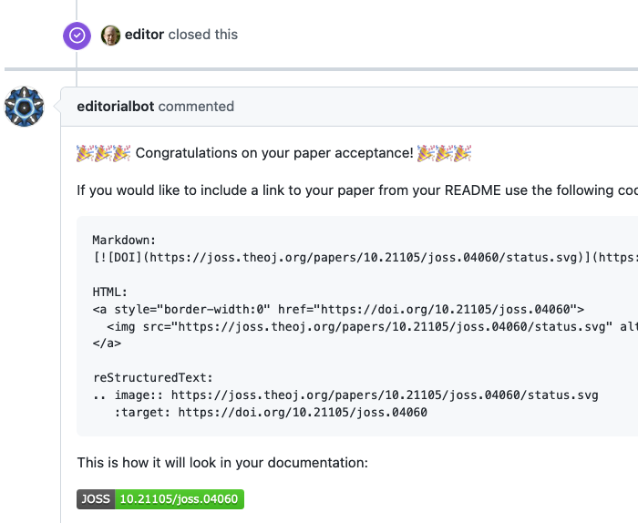

Goodbye
=======

This responder acts when a issue is closed. It can reply with text messages, [using a template](../using_templates) or creating a background job to asynchronously call an external service's API.

Allows [labeling](../labeling).

## Listens to

Issue closed event.

## Settings key

`goodbye`

## Requirements

### When invoking an external service:

Some parameters are required for the external call to work: the `name` of the service and the `url` of the call, both configured in the settings YAML file nested under the `external_service` param.

Similarly to the [External Service responder](./external_service) if the call is successful the response is posted as a comment in the issue (optionally using a template).

You can configure a template file as a response after the external API call, this template is configured separately from the previous general response template. The response from the external service should be in JSON format. It will be parsed and the resulting hash values will be passed to the template.

## Params

For replying with plain text message(s):
```eval_rst
:message: A text message to use as reply.
:messages: *<Array>* A list of text messages to respond with.

```

To reply with a template file:
```eval_rst
:template_file: The name of the template file to use to build the response message.
:data_from_issue: *<Array>* An optional list of values that will be extracted from the issue's body and used to fill the template.

```

Calling an external service:
```eval_rst
:external_service: All the configuration for the service is nested under this param. Possible options are:

  :name: *Required*. The name for this service.
  :url: *Required*. The url to call.
  :method: The HTTP method to use. Valid values: [get, post]. Default is **post**.
  :template_file: The optional template file to use to build the response message after the external call.
  :headers: *<Array>* An optional list of *key: value* pairs to be passed as headers in the external service request.
  :data_from_issue: *<Array>* An optional list of values that will be extracted from the issue's body and used to fill the template.
  :query_params: *<Array>* An optional list of params to add to the query of the external call. Common place to add API_KEYS or other authentication info.
  :mapping: *<Array>* An optional mapping of variable names in the query of the external service call.

```

## Examples

**Simplest use case:**
```yaml
...
  responders:
    goodbye:
      message: "Congratulations on the acceptance of your paper!"
...
```

**Multiple messages and a template only if label present:**
```yaml
...
  responders:
    goodbye:
      if:
        labels:
          - accepted
      messages:
        - "Congratulations on the acceptance of your paper!"
        - "Review process finished. Closing the issue."
      template_file: goodbye.md
      data_from_issue:
        - repository
        - doi
...
```

**Calling an external service:**
```yaml
...
  responders:
    goodbye:
      external_service:
        url: https://dummy-external-service.herokuapp.com/code-analysis
        method: post
        query_params:
          secret: A1234567890Z
        data_from_issue:
          - target-repo
        mapping:
          id: issue_id
...
```
When a new issue is closed the responder will send a POST request to https://dummy-external-service.herokuapp.com/code-analysis with a JSON body:
```
{
 "secret": "A1234567890Z", # declared in the query_params setting
 "target-repo":"...",      # the value is extracted from the body of the issue
 "id":"...",               # the value corresponds to issue_id, it has been mapped to id
 "repo":"...",             # the origin repo where the invocation happened
 "sender":"...",           # the user invoking the command
 "bot_name":"...",         # the bot user name that will be responding
}
```
And the response from the external service will posted as a comment in the original issue.

## In action

### Text messages and template file:

* **`Replying with a template once the issue is closed:`**



