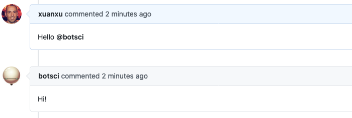

Hello
=====

A simple responder to reply to user greetings.

## Listens to

```
Hi @botname
```
```
Hello @botname
```

## Settings key

`hello`

## Examples

**Simplest use case:**
```yaml
...
  responders:
    hello:
...
```

**Hide from public command list**
```yaml
...
  responders:
    hello:
      hidden: true
...
```
## In action


