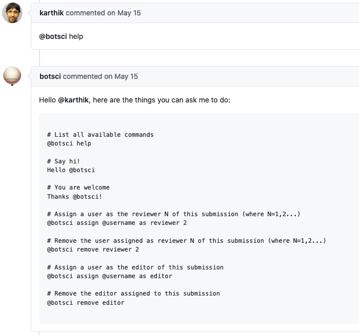

Help
====

The help responder provides a customizable command to list all the available actions. It only lists options available to the user triggering the responder and only responders not marked as `hidden`.


## Listens to

```
@botname help
```
 `help` is the default command, but it is customizable via params.

## Settings key

`help`

## Params
```eval_rst
:help_command: *Optional.* The command triggering this responder. Default value is **help**.

```

## Examples

**Simplest use case:**
```yaml
...
  responders:
    help:
...
```

**Custom command:**
```yaml
...
  responders:
    help:
      help_command: commands
...
```
Now it will reply to `@botname commands`.

## In action



