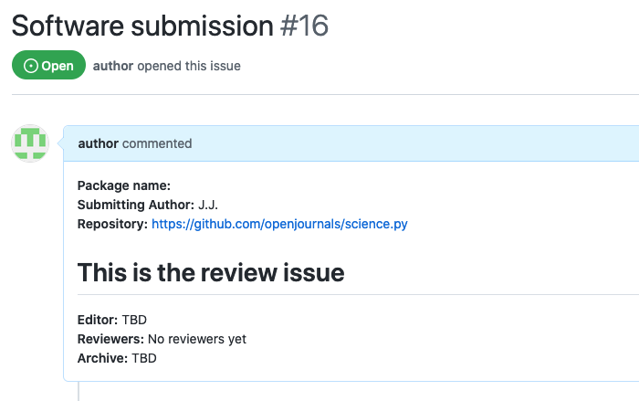
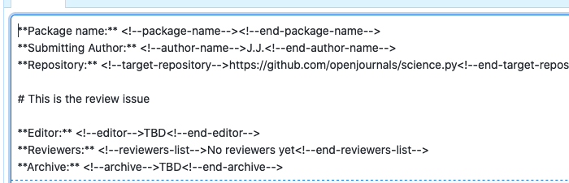
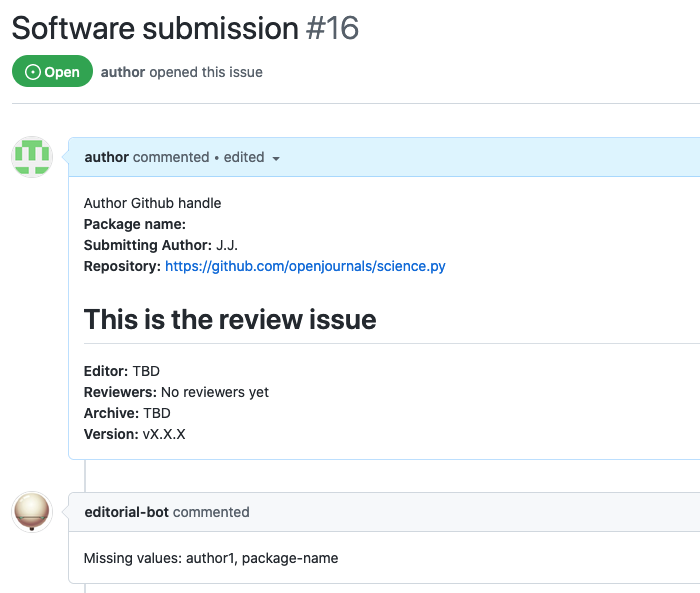
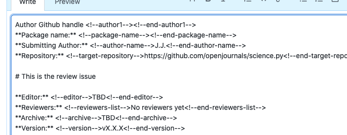

Initial values
==============

This responder acts when a new issue is opened. It checks for the presence of placeholders in the body of the issue for all the configured values.

## Listens to

New issue opened event.

## Settings key

`initial_values`

## Params

The **values** parameter is mandatory.

```eval_rst
:values: An array of values. Optionally each value can be individually customized.

```

For each value listed under **values** this options can be provided:

```eval_rst
:heading: *Optional.* If the value placeholder is missing when adding the value it will include this text as heading instead of just the value name. Default value is the value name capitalized bold.

:value: *Optional* Value to add inside the HTML comments. Default value is empty string.

:action: *Optional* Strategy when value placeholders are not defined in the body of the issue. Valid options: `append` (will add the value at the end of the issue body), `prepend` (will add the value at the beginning of the issue body). Default value is *prepend*

:warn_if_empty: *Optional* If set to *true* if the placeholder for this value is not present or present but empty a new comment will be replied to the issue warning of the missing value. Default is *false*.
```

## Examples

**Simplest use case:**

Verify presence of `<!--version--><!--end-version-->` and `<!--target-repository--><!--end-target-repository-->` in the body of the issue:

```yaml
...
  responders:
    initial_values:
      values:
        - version
        - target-repository
...
```

**Multiple values with custom properties:**

```yaml
...
  responders:
    initial_values:
      values:
        - version:
          - value: "vX.X.X"
          - action: append
        - author1:
          - heading: "Author Github handle:"
          - warn_if_empty: true
        - target-repository
        - archive
        - package-name:
          - warn_if_empty: true
...
```

## In action

Using the _Multiple values with custom properties_ example config:

* **`Initial state:`**



**Actual text in the initial body of the issue:**



* **`Final state:`**



**Actual text in the final body of the issue:**



**Result:**
- _version_ has been appended at the end of the body with a value of _vX.X.X_
- _author1_ has been added with the custom heading
- _target-repository_ was already present, so nothing has been done with it
- _archive_ was already present, so nothing has been done with it
- _package-name_ was not present so it has been prepended.
- New comment was created with a warning of missing values for _package-name_ and _author1_
