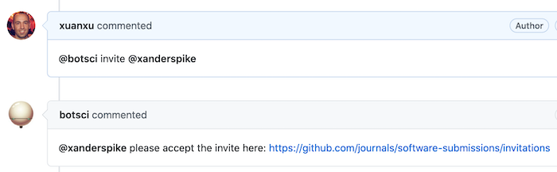

Invite
======

This responder creates a repo invitation for a user to be added as collaborator so they have the needed permissions to edit comments.
Use this responder to send an invitation to a user to collaborate in the review.

## Listens to

```
@botname invite @username
```
## Settings key

`invite`

## Examples

**Simplest use case:**
```yaml
...
  responders:
    invite:
...
```

**Action restricted to users in the editors team:**
```yaml
...
  teams:
    editors: 1111111
...
  responders:
    invite:
      only: editors
...
```

## In action




