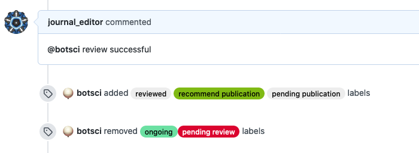

Label command
=============

This responder defines a custom command to add and/or remove labels to the issue when invoked.

## Listens to

```
@botname <command>
```

For example, if you configure the command to be _review successful_, it would respond to:
```
@botname review successful
```

## Settings key

`label_command`

## Params
```eval_rst
:command: The command this responder will listen to.
:labels:  *<Array>* A list of text labels to add to the issue.
:remove:  *<Array>* A list of text labels to remove from the labels of the issue.
```

## Examples

**Simplest use case:**

Just add a label.

```yaml
...
  responders:
    label_command:
      command: review successful
      labels:
        - recommend publication
...
```

**Multiple instances of the responder, restricted to editors, adding and removing labels:**
```yaml
...
  responders:
    label_command:
      - review_ok:
          only: editors
          command: review successful
          labels:
            - reviewed
            - recommend publication
            - pending publication
          remove:
            - ongoing
            - pending review
      - review_nok:
          only: editors
          command: review failed
          labels:
            - recommend rejection
...
```

## In action


