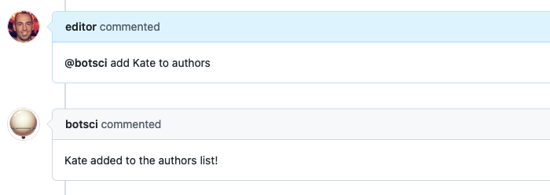
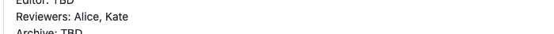

List of values
==============

This responder adds values to/removes values from a list in the body of the issue.
Allows [labeling](../labeling).

## Listens to

```
@botname add <value> to <list-name>
```
```
@botname remove <value> from <list-name>
```

For example, if you configure this responder to add/remove values for the _reviewers_ list, it would respond to:
```
@botname add @username to reviewers
```
## Requirements


The body of the issue should have the target field placeholder marked with HTML comments.

```html
<!--<listname>-list-->  <!--end-<listname>-list-->
```
Following the previous example if the name of the field is _reviewers_:
```html
<!--reviewers-list-->  <!--end-reviewers-list-->
```

## Settings key

`list_of_values`

## Params
```eval_rst
:name: *Required.* The name of the list. It can be set using the ``name:`` keyword, or via the name of each instance if there are several instances of this responder specified in the settings file.

:sample_value:  An optional sample value string for the target field. It is used for documentation purposes when the :doc:`Help responder <./help>` lists all available responders. Default value is **xxxxx**.

:add_as_assignee: *<Boolean>* Optional. If true and the value is a user name, it will be added as assignee to the issue. Default value is **false**.

:add_as_collaborator: *<Boolean>* Optional. If true and the value is a user name, it will be added as collaborator to the repo. Default value is **false**.
```

## Examples

**Simple case: A single list**
```yaml
...
  responders:
    list_of_values:
      name: reviewers
...
```

**Several lists with different options:**
```yaml
...
  responders:
    list_of_values:
      - versions:
          sample_value: "v1.0.2"
      - reviewers
          only: editors
          sample_value: "@username"
          add_as_assignee: true
...
```

## In action

* **`Initial state:`**


* **`Adding to the list:`**



* **`Intermediate state:`**


* **`Removing from the list:`**


* **`Final state:`**


