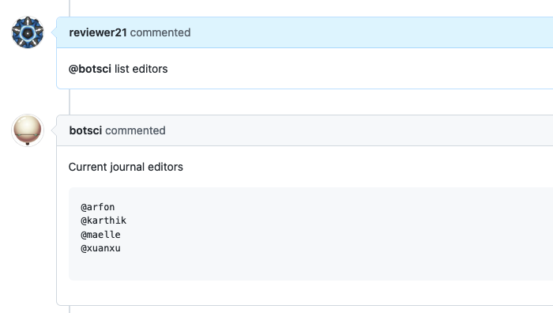

List team members
=================

This responder replies with a list of members from a GitHub team

## Listens to

```
@botname <command>
```

For example, if you configure the command to be _list editors_, it would respond to:
```
@botname list editors
```

## Settings key

`list_team_members`

## Params
```eval_rst
:command: The command this responder will listen to.

:team_id: The id of the GitHub team to be listed.

:heading: *Optional* Heading for the replied list.

:description: *Optional* String to show when the help command is invoked.
```

## Examples

**List editors team members with custom heading**
```yaml
...
  responders:
    list_team_members:
      command: list editors
      team_id: 3824115
      heading: Current journal editors
...
```


## In action


