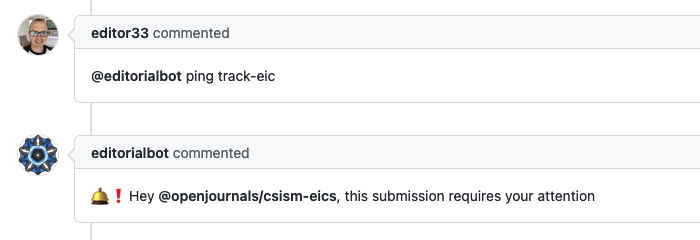

OpenJournals :: Ping track EiCs
===============================

A responder to be used by editors to escalate to the track EiC(s), the bot will respond mentioning the EiCs for the correct track.


## Listens to

```
@botname ping track-eic
```

```
@botname ping track-eics
```

```
@botname ping track eic
```

```
@botname ping track eics
```

## Settings key

`ping_track_eics`

## Params
```eval_rst
:journal_base_url:  *Optional* The base journal URL to use for the track lookup. Default value: `https://joss.theoj.org`
:default_eics_team:  *Optional* The default team to mention if the track API call is nil or unsuccessful. Default: `openjournals/joss-eics`
:eics_teams_suffix: *Optional* The suffix to use with the track name to create the name of the team to mention. Default: `-eics`
```

## Examples

**Simplest use case:**
```yaml
...
  responders:
    ping_track_eics:
      only: editors
...
```

**Customizing journal and default EiCs team**
```yaml
...
  responders:
    ping_track_eics:
      only: editors
      journal_base_url: "https://myjournal.org"
      default_eics_team: "myjournal/all-eics"
...
```
## In action


