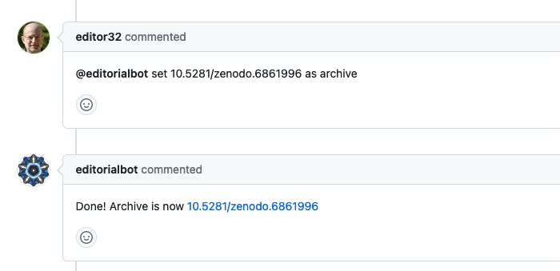
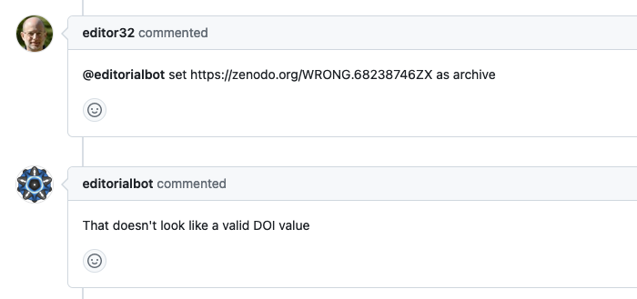

OpenJournals :: Set archive
===========================

This responder can be used to set a valid DOI as the value of the archive field in the body of the issue.

## Listens to


```
@botname set <ARCHIVE-DOI> as archive
```

where ARCHIVE-DOI is a valid DOI

## Requirements

The body of the issue should have the _archive_ field placeholder marked with HTML comments.

```html
<!--archive-->  <!--end-archive-->
```

## Settings key

`openjournals_set_archive`


## Examples

```yaml
...

  responders:
    openjournals_set_archive:
      only: editors
...
```

## In action




* **`DOIs are validated:`**

