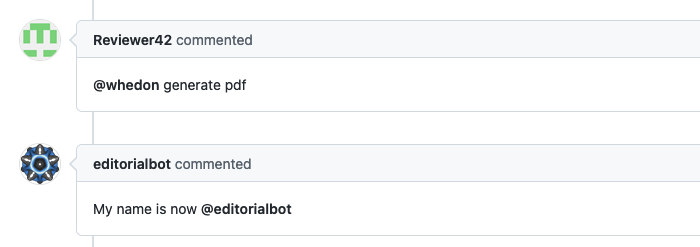

OpenJournals :: Whedon
======================

A hidden responder listening to commands issued to the Open Journal's retired old bot. This responder will reply with a reminder of the new bot name.

## Listens to

```
@whedon <anything>
```

## Settings key

`whedon`

## Params

By default this responder is hidden, so it is not listed by the `help` command. This can be changed setting the `hidden` param to `false`.

## Examples

**Simplest use case:**
```yaml
...
  responders:
    whedon:
...
```

## In action


