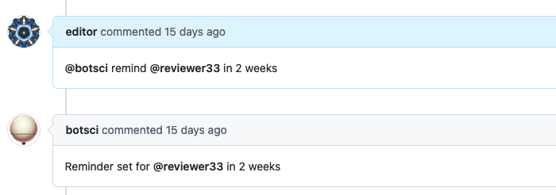
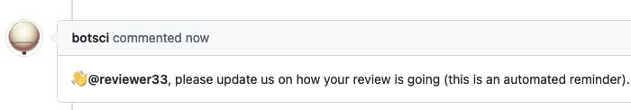

Reminders
=========

This responder allows to schedule a reminder for the author or a reviewer to return to a review after a certain period of time (supported units: days and weeks). The command will only work if the mentioned user is an author, a reviewer for the submission or the sender of the message (so editors can set reminders for themselves).

**Note:** Reviewers and authors can set reminders for themselves even if the responder is configured to be restricted to editors only. This allows reviewers to manage their own review timelines.


## Listens to

```
@botname remind @username in 2 weeks
```
```
@botname remind @reviewer in 10 days
```

## Settings key

`reminders`

## Params
```eval_rst
:reviewers: *Optional.* The HTML-comment value name in the body of the issue to look for reviewers. Default value is **reviewers-list**.
:auhors: *Optional.* The HTML-comment value name in the body of the issue to look for authors. Default value is **author-handle**.

```

## Examples

**Simple use case:**
```yaml
...
  responders:
    reminders:
      only: editors
...
```
With this configuration, only editors can set reminders for anyone (authors, reviewers, or themselves), but reviewers and authors can still set reminders for themselves.

**Custom html fields:**
```yaml
...
  responders:
    reminders:
      only: editors
      authors:
        - author1
        - author2
...
```
Now it will allow to set a reminder for all the users listed in the body of the issue in `reviewers-list`, `author1` and `author2` HTML fields.

## In action

* **`Scheduling a reminder:`**



* **`The reminder:`**




