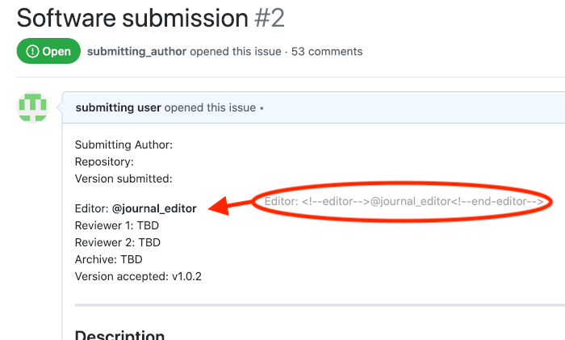
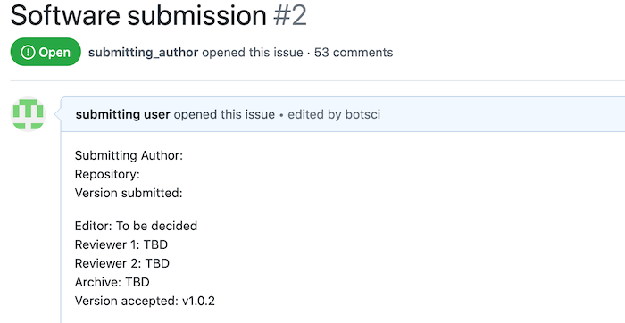

Remove editor
=============

This responder removes the assigned editor from the body of the issue (the one that can be assign using the [Assign Editor responder](./assign_editor)). The user will also be removed from the issue's assignees.

## Listens to

```
@botname remove editor
```


## Requirements

In the body of the issue the editor should be enclosed in HTML comments.

```html
...
<!--editor--> @sarah_m_g <!--end-editor-->
...
```

## Settings key

`remove_editor`

## Params
```eval_rst
:no_editor_text: The text that will go in the editor place to state there's no one assigned. The default value is **Pending**.
```

## Examples

**Simplest use case:**
```yaml
...
  responders:
    remove_editor:
...
```

**Action restricted to editors:**
```yaml
...
  teams:
    editors: 1111111
...
  responders:
    remove_editor:
      only: editors
...
```

**Restrict access to editors, use custom text for not assigned reviewers:**
```yaml
...
  responders:
    remove_editor:
      only: editors
      no_editor_text: To be decided
...
```

## In action

* **`Initial state:`**



* **`Invocation:`**


* **`Final state:`**



