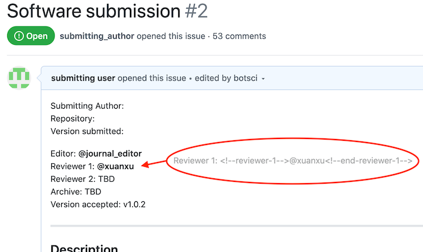
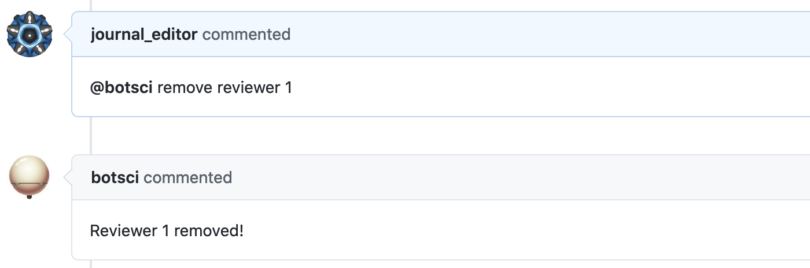
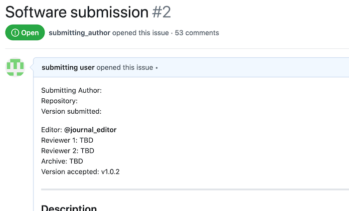

Remove reviewer N
=================

This responder removes any numbered reviewer from the body of the issue (the ones that can be set by the Assign Reviewer N responder).

## Listens to

```
@botname remove reviewer N
```
where N is a number.


## Requirements

In the body of the issue the reviewers should be enclosed in HTML comments.

```html
Reviewer 1: <!--reviewer-1--> @sarah_m_g <!--end-reviewer-1-->
Reviewer 2: <!--reviewer-2--> @cordeliaChase <!--end-reviewer-2-->
Reviewer 3: <!--reviewer-3--> @spike33 <!--end-reviewer-3-->
...
```

## Settings key

`remove_reviewer_n`

## Params
```eval_rst
:no_reviewer_text: The text that will go in the removed reviewer place to state there's no one assigned. Default value is **Pending**.
```

## Examples

**Simplest use case:**
```yaml
...
  responders:
    remove_reviewer_n:
...
```

**Action restricted to editors:**
```yaml
...
  teams:
    editors: 1111111
...
  responders:
    remove_reviewer_n:
      only: editors
...
```

**Restrict access to editors, use custom text for not assigned reviewers:**
```yaml
...
  responders:
    remove_reviewer_n:
      only: editors
      no_reviewer_text: TBD
...
```

## In action

* **`Initial state:`**



* **`Invocation:`**



* **`Final state:`**



