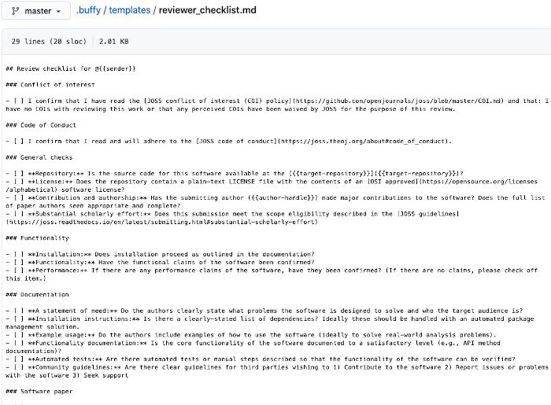
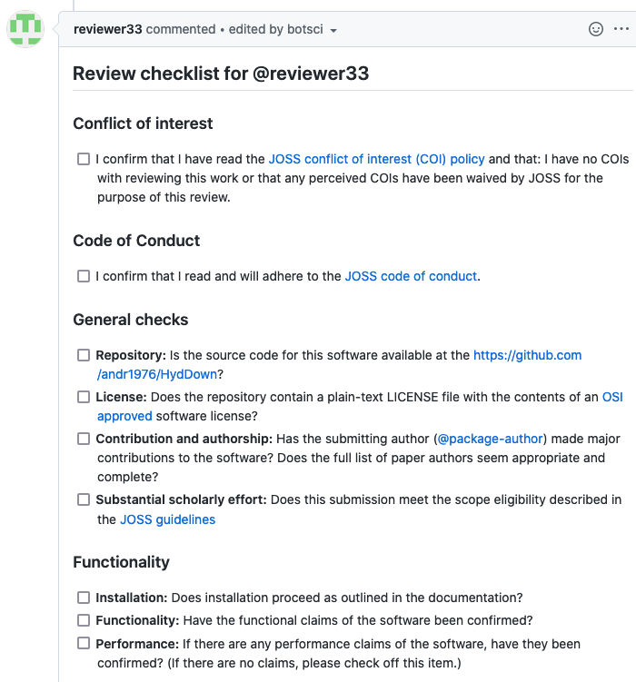

Reviewer checklist comment
==========================

This responder adds a reviewer checklist editing the comment triggering the responder if the author of the comment is a reviewer. This way of adding checklists (instead of adding them to the body of the issue) does not require the reviewers to be collaborator of the repository, as they will be able to edit their own comments to update the progress of the checklist.

## Listens to

```
@botname generate my checklist
```

## Requirements

The checklist is read from a template file that should be available in the repository.

## Settings key

`reviewer_checklist_comment`

## Params
```eval_rst
:template_file: *Required*. The name of the template file to edit the comment with.
:data_from_issue: *<Array>* An optional list of values that will be extracted from the issue's body and used to fill the template.
:command: Optional. The command triggering this responder. Default is *generate my checklist*
```

## Examples

**Simplest use case:**
```yaml
...
  responders:
    add_remove_checklist:
      template_file: reviewer_checklist.md
...
```

**Using info from the body to fill in the template. Custom command:**
```yaml
...
  responders:
    add_remove_checklist:
      command: create reviewer checklist
      template_file: reviewer_checklist.md
      data_from_issue:
        - target-repository
        - author-handle
...
```

## In action

* **`The template:`**



* **`Invocation:`**


* **`Comment edited by the bot:`**


