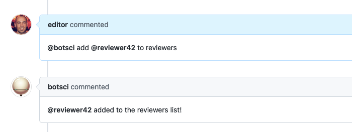
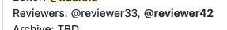
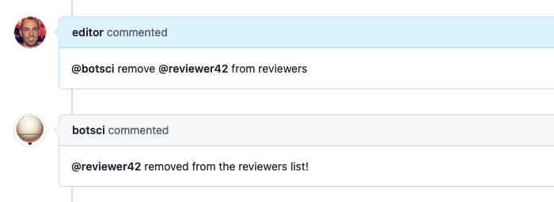
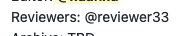

Reviewers list
==============

This responder adds/removes usernames to/from the list of reviewers in the body of the issue.
Allows [labeling](../labeling).

## Listens to

```
@botname add <username> as reviewer
```
```
@botname add <username> to reviewers
```
```
@botname remove <username> from reviewers
```

## Requirements


The body of the issue should have the target field placeholder marked with HTML comments.

```html
<!--reviewers-list-->  <!--end-reviewers-list-->
```

## Settings key

`reviewers_list`

## Params
```eval_rst
:sample_value: *<String>* An optional sample value string for the target field. It is used for documentation purposes when the :doc:`Help responder <./help>` lists all available responders. Default value is **@username**.

:no_reviewers_text: The text that will go in the reviewers list place to state there are no reviewers assigned yet. The default value is **Pending**.

:add_as_assignee: *<Boolean>* Optional. If true, when adding a new reviewer will be added as assignee to the issue. Default value is **false**.

:add_as_collaborator: *<Boolean>* Optional. If true, when adding a new reviewer will be added as collaborator to the repo. Default value is **false**.
```

## Examples

**Simplest case:**
```yaml
...
  responders:
    reviewers_list:
...
```

**With different options:**
```yaml
...
  responders:
    reviewers_list:
      only: editors
      sample_value: "@reviewer-login"
      add_as_assignee: true
...
```

## In action

* **`Initial state:`**


* **`Adding a reviewer:`**



* **`Reviewer added:`**



* **`Removing a reviewer:`**



* **`Reviewer removed:`**


