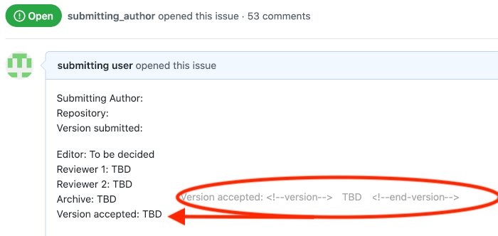
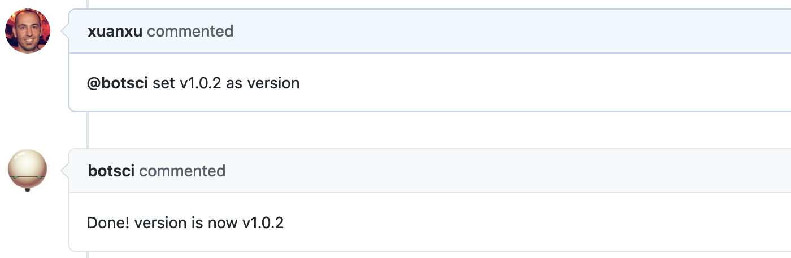
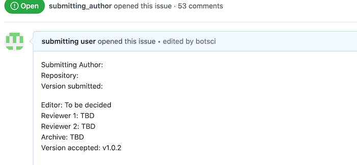

Set value
=========

This responder can be used to update the value of any field in the body of the issue.

## Listens to

```
@botname set <value> as <name>
```

for example, if you configure this responder to change the value of the _version_, it would respond to:
```
@botname set v1.0.3 as version
```

## Requirements

The body of the issue should have the target field placeholder marked with HTML comments.

```html
<!--<name>-value-->  <!--end-<name>-value-->
```
following the previous example if the name of the field is _version_:
```html
<!--version-value-->  <!--end-version-value-->
```

## Settings key

`set_value`

## Params
```eval_rst
:name: *Required.* The name of the target field in the body of the issue. It can be set using the ``name:`` keyword, or via the name of each instance if there are several instances of this responder specified in the setting file.

:sample_value:  A sample value string for the target field. It is used for documentation purposes when the :doc:`Help responder <./help>` lists all available responders. Default value is **xxxxx**.
```

## Examples

**Simplest use case:**
```yaml
...
  responders:
    set_value:
      name: version
      sample_value: v1.0.1
...
```

**Multiple instances of the responder, some of them restricted to editors:**
```yaml
...
  responders:
    set_value:
      - version:
          only: editors
          sample_value: "v1.0.0"
      - archive:
          only: editors
          sample_value: "10.21105/joss.12345"
      - repository:
          sample_value: "github.com/openjournals/buffy"
...
```

## In action

* **`Initial state:`**



* **`Invocation:`**



* **`Final state:`**


