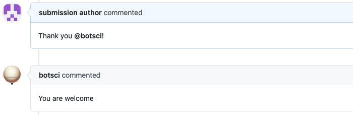

Thanks
======

This responder replies when a user thanks the bot.

## Listens to

```
Thanks @botname
```
```
Thank you @botname
```
```
@botname thanks
```
```
@botname thank you
```

## Settings key

`thanks`

## Params
```eval_rst
:reply: The message the bot will send back. Default value is **"You are welcome"**.

```

## Examples

**Simplest use case:**
```yaml
...
  responders:
    thanks:
...
```

**Custom message and hidden from public command list:**
```yaml
...
  responders:
    thanks:
      reply: "No problem, I'm here to help!"
      hidden: true
...
```
## In action



