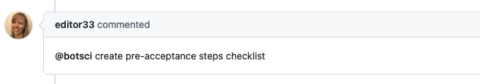
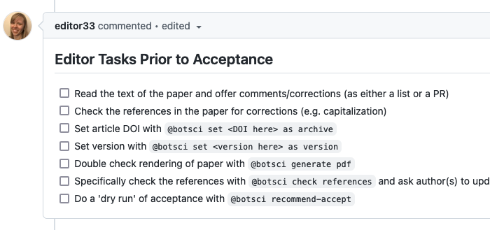

Update comment
==============

This responder edits the comment triggering the responder updating it with the content of a customizable [template file](../using_templates).

These updates of the original comment are useful to add content (for instance: checklists) to be modified/updated by the original author of the comment, as they are always allowed to edit their own comments, not requiring to add them as collaborator of the repository/organization.

## Listens to

```
@botname <command>
```

For example, if you configure the command to be _list pre-acceptance tasks_, it would respond to:
```
@botname list pre-acceptance tasks
```

## Requirements

The response is generated using a template file that should be available in the repository.

## Settings key

`update_comment`

## Params
```eval_rst
:command: *Required*. The command this responder will listen to.
:template_file: *Required*. The name of the template file to edit the comment with.
:description:  *Optional* String to show when the help command is invoked.
```

## Examples

**Simplest use case:**
```yaml
...
  responders:
    update_comment:
      command: list tasks
      template_file: tasks.md
...
```

**Limiting use to editors team and adding info to use in the template:**
```yaml
...
  responders:
    add_remove_checklist:
      only: editors
      command: create pre-acceptance steps checklist
      template_file: editor_final_checklist.md
      data_from_issue:
        - target-repository
        - author-handle
...
```

## In action

* **`Invocation:`**



* **`Comment edited by the bot:`**


