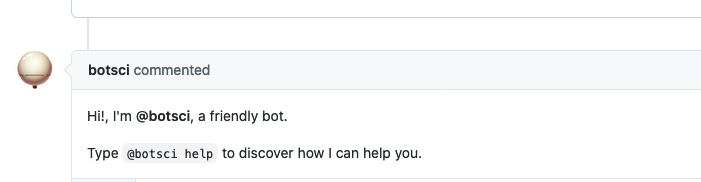

Welcome
=======

This responder sends a message when a new issue is opened.
Allows [labeling](../labeling).

## Listens to

New issue opened event.

## Settings key

`welcome`

## Params
```eval_rst
:reply: The message the bot will send. Default value is: **Hi!, I'm <@botname>, a friendly bot. Type '<@botname> help' to discover how I can help you**.

:hidden: Is **true** by default.

```

## Examples

**Simplest use case:**
```yaml
...
  responders:
    welcome:
...
```

**Custom message:**
```yaml
...
  responders:
    welcome:
      reply: "Thanks for your submission!"
...
```

**Multiple messages:**
```yaml
...
  responders:
    welcome:
      - thank_user:
          reply: "Thanks for consider our journal for your submission!"
      - default_msg:
      - info:
          reply: "The review will start once two reviewers are assigned, please stay tuned."
...
```
## In action



