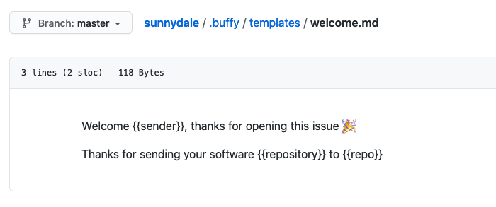
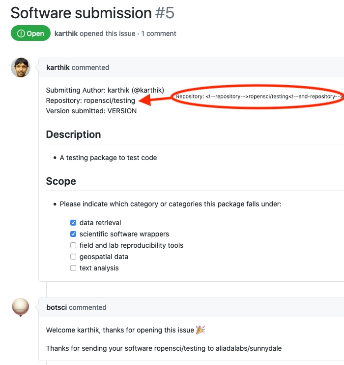

Welcome template
================

This responder uses a template to send a message when a new issue is opened.

To render the template a map of values will be passed to it:
- **issue_id**: The id of the issue
- **repo**: the name of the repository
- **sender**: the handle of the user creating the issue
- **bot_name**: the name of the bot user responding

If the template needs some other value included in the body of the issue, they can be declared using the `data_from_issue` param and those values will be passed to the template too, if can be extracted from the body. They can be used in the template using the syntax:
```
{{variable_name}}
```

Allows [labeling](../labeling).

## Listens to

New issue opened event.


## Requirements

In order to use a template, Buffy will look for the file declared in the `template_file` param in the target repo, in the location specified with the `template_path` setting (by default `.buffy/templates`). In short: the *template_file* should be located in the *template_path*.

The values needed by the template that are listed in the `data_from_issue` param must be extractable: they have to be enclosed in HTML comments:

```html
<!--<name>--> Info to extract <!--end-<name>-->
```
So, for example, if you want to use the value of _version_ in the template, the body of the issue must include it inside HTML comments:
```html
<!--version--> v2.1 <!--end-version-->
```
Then it should be declared in the settings file, listed in the _data_from_issue_ param:
```yaml
  responders:
    welcome_template:
      template_file: welcome.md
      data_from_issue:
        - version
```

And can then be used in the template:
```
Thank you for your submission, we will review the {{version}} release of your software.
```

## Settings key

`welcome_template`

## Params
```eval_rst
:template_file: *Required*. The name of the template file to use to build the response message.
:data_from_issue: *<Array>* An optional list of values that will be extracted from the issue's body and used to fill the template.
:hidden: Is **true** by default.

```

## Examples

**Simplest use case:**
```yaml
...
  responders:
    welcome_template:
      template_file: welcome.md
...
```

**Include information from the issue's body:**
```yaml
...
  responders:
    welcome_template:
      template_file: welcome.md
      data_from_issue:
        - version
        - submission-date
        - category
...
```

## In action
* **`The template file:`**



* **`In use:`**



