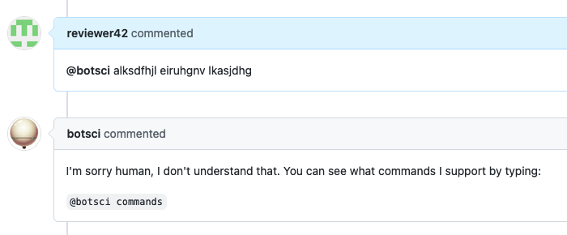

Wrong command
=============

This is a special responder that replies when Buffy receives a command directed to the bot that no responder understand. By default it replies with:

```text
I'm sorry human, I don't understand that. You can see what commands I support by typing:

@botname help
```

But the reply can be configured to be a custom message or to use a template.

## Listens to

```
@botname whatever is not a command to other responder
```

## Settings key

If using default reply this responder doesn't need to be added to the config file. Otherwise:

`wrong_command`

## Params
```eval_rst
:ignore: *Optional.* If `true` this responder won't act. Default value: `false`.
:template_file: *Optional.* A template file to use to build the response message.
:message: *Optional.* A text message to use as reply.

```

## Examples

**Simplest use case:**

Nothing added to the config file, it will reply the default response

```yaml
...
  responders:

...
```

**Deactivate responder:**

```yaml
...
  responders:
    wrong_command:
      ignore: true
...
```

**Use custom message:**

```yaml
...
  responders:
    wrong_command:
      message: "Say what?"
...
```

## In action

* **`Unknown command:`**


